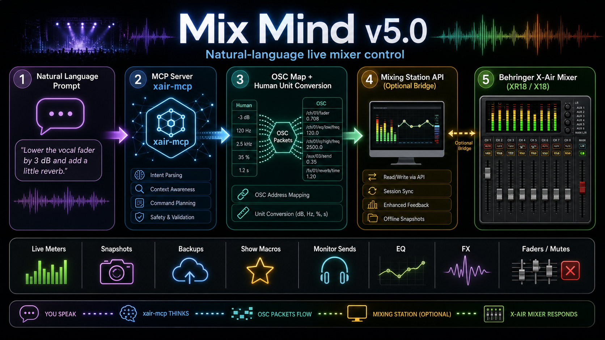

# Mix Mind v5.0



**Mix Mind v5.0** is a Model Context Protocol server for natural-language control of a **Behringer X-Air 18 / XR18 / X18** mixer, with optional integration for the **Mixing Station** desktop app.

It lets an AI assistant act like a live sound tech: check the board, move faders, adjust monitor sends, tune EQ, manage FX, save snapshots, dump backups, inspect meters, and run show macros using normal language.

## What It Does

| Area | What Mix Mind controls |
| --- | --- |
| Discovery | Finds X-Air mixers on the local network with `/xinfo` broadcast. |
| Direct mixer control | Talks to the mixer over OSC on UDP port `10024`. |
| Mixing Station bridge | Uses the Mixing Station REST/WebSocket API when enabled. |
| Channel work | Reads names, colors, mutes, faders, LR assignment, preamp, gate, dynamics, EQ, and sends. |
| Monitor mixes | Sets channel sends to buses 1-6 and FX sends 1-4 in human dB values. |
| EQ and processing | Converts human values like Hz, dB, Q, pan, gain, and thresholds into X-Air wire values. |
| Snapshots and backups | Lists, saves, loads, and backs up mixer state. |
| Live checks | Reads meters and detects clipping or hot signals. |
| Show macros | Runs repeatable actions like break music, show mode, mute inputs, kill FX, and restore FX. |
| OSC map search | Includes a large searchable X-Air OSC map for advanced or undocumented parameters. |

## Included MCP Tools

Mix Mind exposes these tools to your MCP client:

`xair_discover`, `xair_connect`, `xair_info`, `xair_map_search`, `xair_map_describe`, `xair_get`, `xair_set`, `xair_batch_set`, `xair_node_dump`, `xair_channel_overview`, `xair_fader`, `xair_mute`, `xair_mute_group`, `xair_send_level`, `xair_channel_detail`, `xair_eq_band`, `xair_headamp`, `xair_fx`, `xair_snapshot_list`, `xair_snapshot_save`, `xair_snapshot_load`, `xair_backup_dump`, `xair_meters`, `xair_macro_list`, `xair_macro_run`, `xair_macro_save`, `ms_app_state`, `ms_api`, and `ms_value`.

## Requirements

- Python `3.10` or newer
- A Behringer X-Air mixer on the same network
- An MCP client such as Claude Desktop
- Optional: Mixing Station Desktop with its API enabled

## Install

Clone the repo and install it in editable mode:

```bash
git clone https://github.com/mlmil/Mix_Mind_v5.0.git
cd Mix_Mind_v5.0
python3 -m pip install -e .
```

## MCP Client Configuration

Add this server to your MCP client configuration. For Claude Desktop on macOS, edit:

```text
~/Library/Application Support/Claude/claude_desktop_config.json
```

Example:

```json
{
  "mcpServers": {
    "mix-mind": {
      "command": "python3",
      "args": ["-m", "xair_mcp.server"],
      "cwd": "/absolute/path/to/Mix_Mind_v5.0",
      "env": {
        "XAIR_HOST": "192.168.1.50",
        "MS_API_URL": "http://127.0.0.1:8080"
      }
    }
  }
}
```

`XAIR_HOST` is optional. If you do not know the mixer IP, ask your assistant to run `xair_discover`, then connect with `xair_connect`.

`MS_API_URL` is only needed for the `ms_*` tools. In Mixing Station Desktop, enable the API in settings, then use the local URL shown by the app.

## Quick Start

1. Put your computer and X-Air mixer on the same network.
2. Install the package with `python3 -m pip install -e .`.
3. Add the MCP config above to your client.
4. Restart your MCP client.
5. Ask: `Find my X-Air mixer and show me the board overview.`

## Sample Prompts

Try prompts like these:

- "Find my X-Air mixer on the network."
- "Connect to the mixer at 192.168.1.50."
- "Show me the whole board with names, faders, mutes, and LR assignments."
- "Bring lead vocal up 2 dB."
- "Mute channel 5."
- "Give the drummer more lead vocal in bus 2."
- "Set channel 9 preamp gain to 24 dB."
- "Turn phantom power on for channel 12 after confirming with me."
- "Cut 3 kHz on the lead vocal by 4 dB."
- "Show me the gate and compressor settings on the kick."
- "Kill the reverb while I talk."
- "Restore the FX returns."
- "Put us in break music mode."
- "Save the current mixer state as a snapshot named Riverside Set."
- "Back up the full desk before the show."
- "Watch the meters for clipping for 5 seconds."
- "Search the X-Air map for compressor knee on bus 1."
- "Use Mixing Station to read `ch.0.mix.lvl`."

## Show Macros

Macros live in [presets/band_presets.json](presets/band_presets.json). The included defaults cover:

| Macro | Purpose |
| --- | --- |
| `line_check_safe` | Sets a safer line-check baseline without touching phantom power. |
| `mute_all_inputs` | Mutes channels 1-16. |
| `unmute_all_inputs` | Unmutes channels 1-16. |
| `break_music` | Mutes band inputs and brings up aux/USB playback. |
| `show_mode` | Returns from break music to live input mode. |
| `kill_fx` | Mutes FX returns for talking between songs. |
| `restore_fx` | Unmutes FX returns. |

Run them with prompts such as:

```text
Run the break_music macro.
Run kill_fx, then restore_fx after I finish talking.
Save a new macro that mutes all vocals and leaves drums live.
```

## Safety Notes

- Loading a snapshot changes the entire mixer immediately. Confirm before doing it during a show.
- Phantom power can pop speakers and damage some connected gear. Confirm before toggling it.
- Snapshot slot 64 may be used by Mixing Station for bus-password data. Avoid overwriting it unless you know it is safe.
- Some OSC map entries come from community documentation. Use `xair_node_dump` or readback tools to verify uncertain parameters against your own mixer.
- Backups are written to `backups/`, which is intentionally ignored by Git.

## Development

Run the tests:

```bash
python3 -m pytest tests/
```

Project layout:

```text
xair_mcp/server.py       MCP tools and show workflow helpers
xair_mcp/osc_client.py   Lightweight OSC client
xair_mcp/osc_map.py      Searchable X-Air OSC address map
xair_mcp/conversions.py  Human units to mixer wire values
xair_mcp/ms_client.py    Mixing Station API client
presets/                 Show macros
tests/                   Unit and mock-mixer tests
```

## Repository

GitHub: [mlmil/Mix_Mind_v5.0](https://github.com/mlmil/Mix_Mind_v5.0)
